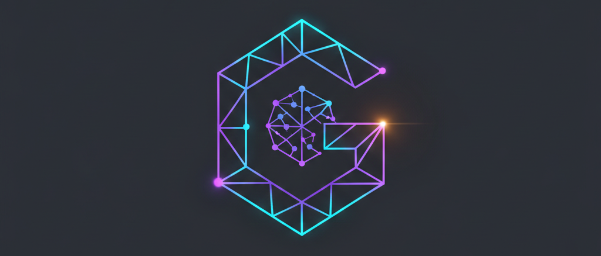

# Genesis Scaffolding

<p align="center">
  
</p>

Genesis Scaffolding is a **general-purpose, capability-stacked application scaffolding** for building production-ready LLM-powered applications.

It provides a modular foundation of well-engineered layers — Python monorepo, FastAPI backend, NextJS frontend, CLI/TUI — with optional capabilities you can adopt piecemeal: an **agent harness** with tool calls and memory, a **workflow engine**, **cron scheduling**, and a **productivity system** (tasks, projects, calendar, journal).

The included demo application is a **personal AI assistant** that uses all of these capabilities. But the scaffolding is designed to be stripped down: you can build a pure CRUD dashboard, an agent-enabled specialized app, a CLI-only tool, or anything in between.

> **For a complete architectural overview, see [docs/architecture/scaffolding-overview.md](docs/architecture/scaffolding-overview.md).**

## Project Goals

Genesis Scaffolding serves three complementary purposes:

**A scaffolding for developers** — a well-engineered, layered foundation for building production-ready LLM-powered applications. Pick only the layers you need: start with the Python monorepo and FastAPI backend, add the agent harness, workflow engine, productivity system, and scheduling layer as your application grows. Codebase designed for legibility by humans and AI agents alike.

**A demo application for users** — a fully functional personal AI assistant that demonstrates every capability the scaffolding provides. Use it as a starting point, customize it heavily, or strip out everything except what you need and build something different.

**A laboratory for agent research** — an experimental testbed for making small and medium language models more practical, efficient, and safe to run. Swap in different agent loops, memory systems, RAG strategies, and tool-calling patterns. Validate everything against real agent sessions.

For the full statement of project goals, see [docs/project_goals.md](docs/project_goals.md).


## User Guide

For the full user guide, including configuration options, running the server, and interacting with agents and workflows, see [docs/user_guides/](docs/user_guides/).

### Prerequisites

* **Git**: For cloning the repository.
* **uv**: The high-performance Python package manager used for environment and dependency management.

### Quick Setup

```bash
git clone https://github.com/your-repo/genesis-scaffolding.git
cd genesis-scaffolding
cp .env.example .env
uv sync
uv run myproject --help
```

See [docs/user_guides/](docs/user_guides/) for detailed setup instructions, LLM provider configuration, and usage examples.

## Developer Guide

### Project Initialization

1. **Clone & Reset:** Shallow clone this repo, delete the `.git` directory, and run `git init` to start a fresh history.
2. **Rename Project:** Run `./scripts/rename.sh` immediately.
  - This script performs a global search-and-replace (e.g., changing `myproject` to `myai`).
  - **Note:** Rename before making logic changes to avoid breaking imports. All package names (e.g., `myproject-cli` -> `myai-cli`) will update accordingly.
3. **Sync Environment:** Run `uv sync` to install dependencies and set up the workspace.
4. **Verify:** Run `uv tree` to inspect the dependency graph and ensure sub-repos are correctly linked.

### Running the Application

Use `uv` to ensure the correct virtual environment and interpreter are used.

* **Default Entry Point:** `uv run myproject`
* **Help / Commands:** `uv run myproject --help`
* **Flow:** The main module initializes the system and launches the CLI. The CLI launches the TUI by default unless a specific subcommand is used.


### Development Workflow

#### Standard Commands (Makefile)

All backend tasks are prefixed to distinguish them from future frontend components.

| Command | Action |
| --- | --- |
| `make setup` | Installs dependencies and git hooks |
| `make backend-format` | Formats code via Ruff |
| `make backend-lint` | Lints code via Ruff |
| `make backend-typecheck` | Static type analysis via Pyright |
| `make backend-test` | Executes Pytest across all workspace members |
| `make backend-check-all` | Sequential lint, type-check, and test |


#### Managing Dependencies

In a monorepo, dependencies are managed at the package level, but synchronized at the root.

**Global Sync:** Run `uv sync` from the root. This updates the shared `uv.lock` and ensures the single virtual environment (`.venv`) has all packages required by every sub-repo.

**Adding a Library to a Sub-repo:** Use the `--package` flag to specify which sub-repo needs the library.
```bash
# Adds 'requests' specifically to the API server
uv add --package myproject-server requests

```
**Adding Development Tools:** To add tools used across the entire repo (like a new linter or utility), add them as dev dependencies at the root.
```bash
uv add --dev debugpy
```


#### Expanding the Monorepo (Adding Sub-repos)

The workspace architecture allows you to add new projects (like a GUI or a worker) while sharing the same core logic.

1. **Initialize the Sub-repo:**
Create a new directory with a library template.
```bash
uv init --lib myproject-gui

```

2. **Register with Workspace:**
Open the **root** `pyproject.toml` and add the new directory to the `members` list:
```toml
[tool.uv.workspace]
members = ["myproject-core", "myproject-cli", "myproject-gui"]

```


3. **Link Internal Dependencies:**
To allow the new sub-repo to use your core logic, link it using the `--package` flag. This creates a "workspace reference" rather than downloading a version from PyPI.
```bash
uv add --package myproject-gui myproject-core

```

4. **Finalize:**
Run `uv sync`. The new package is now "editable," meaning changes made in `myproject-core` are instantly available in `myproject-gui` without a reinstall.


#### Important: Imports vs. Project Names

A common point of confusion in this monorepo is the difference between the **Project Name** (used by `uv`) and the **Package Name** (used in Python code).

* **Project Name (Hyphens):** Used in `pyproject.toml` and `uv` commands (e.g., `myproject-core`).
* **Package Name (Underscores):** Used in your `.py` files (e.g., `import myproject_core`).

If you add a sub-repo and cannot import it, check that you are using underscores in your `import` statements.


## Architecture

### Sub-repo Breakdown

| Package | Purpose |
|---|---|
| **`myproject-core`** | Shared logic: agent, clipboard, memory, workflows, prompts, LLM abstraction, config |
| **`myproject-tools`** | 30+ built-in tools: file ops, productivity, memory, web, PDF, arxiv |
| **`myproject-cli`** | Typer CLI entry point |
| **`myproject-tui`** | Textual TUI (**stub** — for future development) |
| **`myproject-server`** | FastAPI REST API, auth, SSE streaming |
| **`myproject-frontend`** | NextJS frontend (separate web app) |

> **Note on Imports:** Project names use hyphens (`myproject-core`), but Python packages use underscores. Always import using underscores: `import myproject_core`.

### Implementation Details

Each sub-repo is a standalone Python project with its own `pyproject.toml`. The root uses **UV Workspaces** to:

* Maintain a single shared `.venv` at the root.
* Enable editable installs between sub-repos (changes in `core` are immediately reflected in `cli` without re-installing).

See [docs/architecture/scaffolding-overview.md](docs/architecture/scaffolding-overview.md) for the complete architectural overview and capability map.
